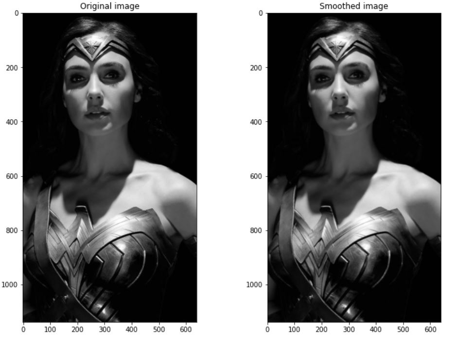
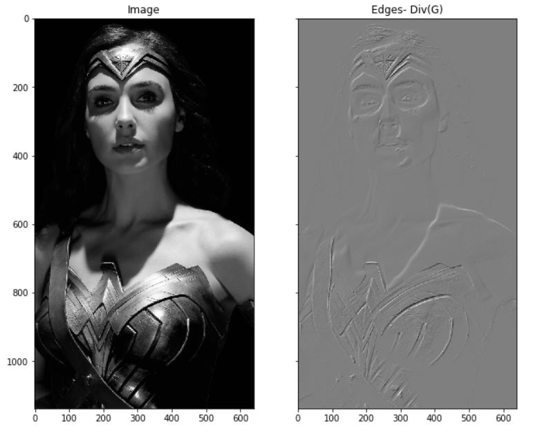
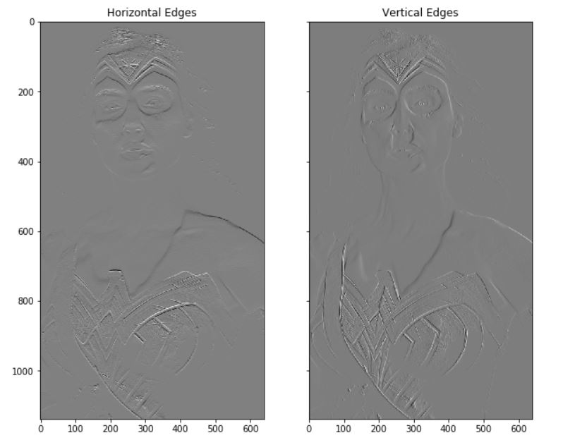
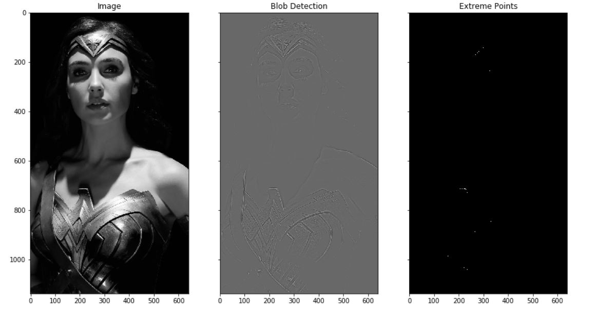
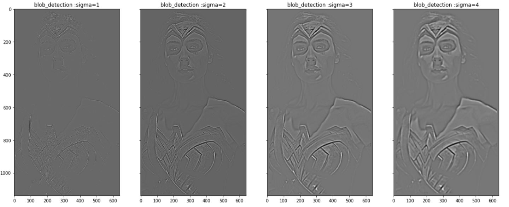
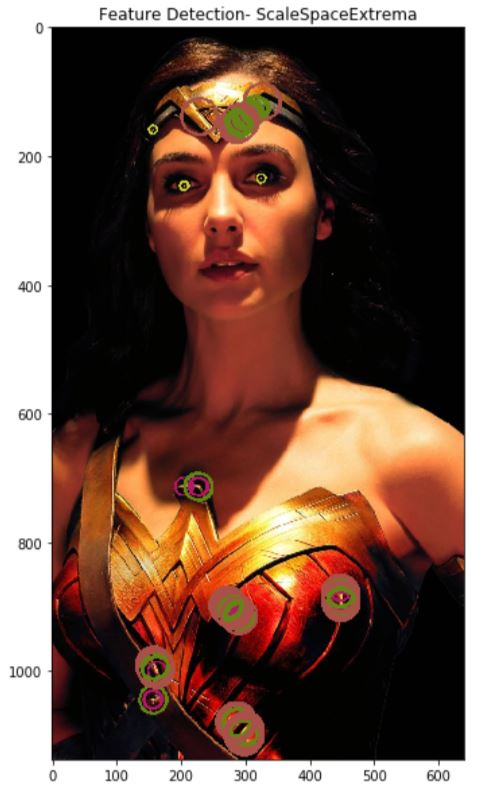

# ImageProcessing-numpyonly
This repo contains implementations for various image processing techniques only using NUMPY

## 1. Gaussian Smoothing

**Fig :** Gaussian Smoothing

## 2. Edge Detection

**Fig :** Edge detection using Divergence of Gaussian kernels

**Fig :** Horizontal and Vertical edge detection

## 3. Blob Detection

**Fig :** Blob detection using Laplacian kernels

## 4. Scale-space-maxima Feature Extraction

**Fig :** Blob detection on scale space

**Fig :** Scale space maxima features

